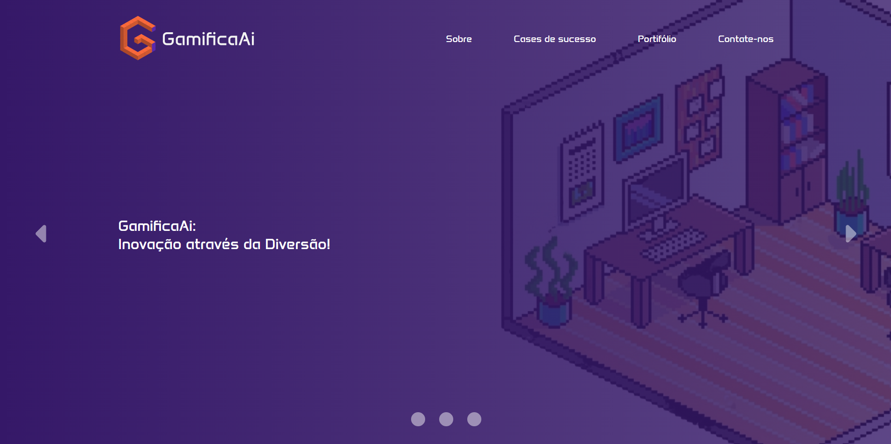

# 🎮 Portfólio de Empresa de Gamificação – SENAI

## 📌 Sobre o Projeto
Projeto de portfólio institucional desenvolvido no SENAI, simulando o site de uma empresa de gamificação.

O portfólio apresenta cases de gamificação que a empresa realizou. Esses dados são carregados dinamicamente a partir de um banco de dados em JSON, utilizando JSON Server.

---

## 🎯 Objetivo
- Praticar desenvolvimento front-end
- Trabalhar com dados dinâmicos
- Aprender o uso de JSON Server
- Criar um layout responsivo
- Simular um projeto próximo ao mercado real

---

## 🛠️ Tecnologias Utilizadas
- HTML5
- CSS3
- JavaScript
- JSON Server
- Banco de dados em JSON

---

## ⚠️ Observação Importante
Para visualizar corretamente os cases de gamificação, é necessário rodar o JSON Server, pois os dados não são estáticos.

---

## ▶️ Como Rodar o Projeto

### Pré-requisitos
- Node.js instalado na máquina

### Passo a passo

1. Clone o repositório:
git clone https://github.com/seu-usuario/seu-repositorio.git

2. Acesse a pasta do projeto:
cd nome-do-projeto

3. Instale o JSON Server (caso não tenha):
npm install -g json-server

4. Inicie o servidor JSON:
json-server --watch db.json

5. Abra o arquivo index.html no navegador

---

## 📸 Screenshot do Projeto

---

## 📚 Aprendizados
- Consumo de dados com JavaScript
- Simulação de API REST
- Organização de projetos front-end
- Desenvolvimento de layout responsivo

==================================================

# 🎮 Gamification Company Portfolio – SENAI

## 📌 About the Project
Institutional portfolio developed at SENAI, simulating a gamification company website.

The portfolio displays gamification cases loaded dynamically from a JSON database using JSON Server.

---

## 🎯 Goal
- Practice front-end development
- Work with dynamic data
- Learn JSON Server
- Build a responsive layout
- Simulate a real-world project

---

## 🛠️ Technologies Used
- HTML5
- CSS3
- JavaScript
- JSON Server
- JSON Database

---

## ⚠️ Important Note
To correctly view the gamification cases, JSON Server must be running, as the data is not static.

---

## ▶️ How to Run the Project

### Requirements
- Node.js installed

### Steps

1. Clone the repository:
git clone https://github.com/your-username/your-repository.git

2. Navigate to the project folder:
cd 

3. Install JSON Server (if needed):
npm install -g json-server

4. Start the server:
json-server --watch db.json

5. Open index.html in your browser

---

## 📸 Project Screenshot

---

## 📚 Learnings
- Data fetching with JavaScript
- REST API simulation
- Front-end project structure
- Responsive design
